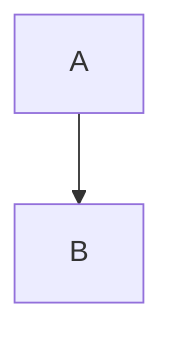
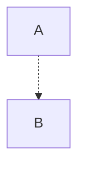
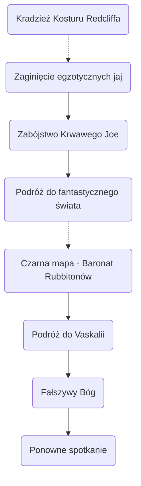
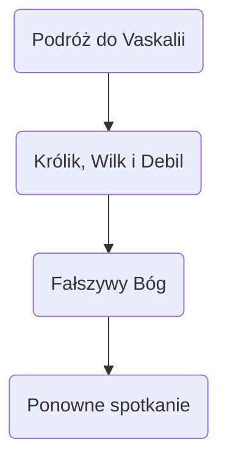
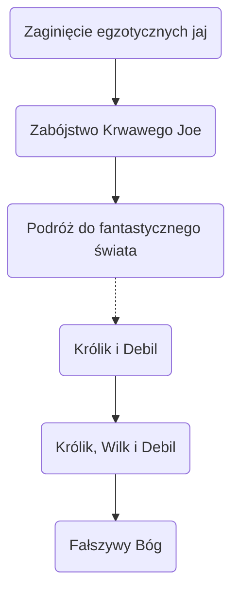
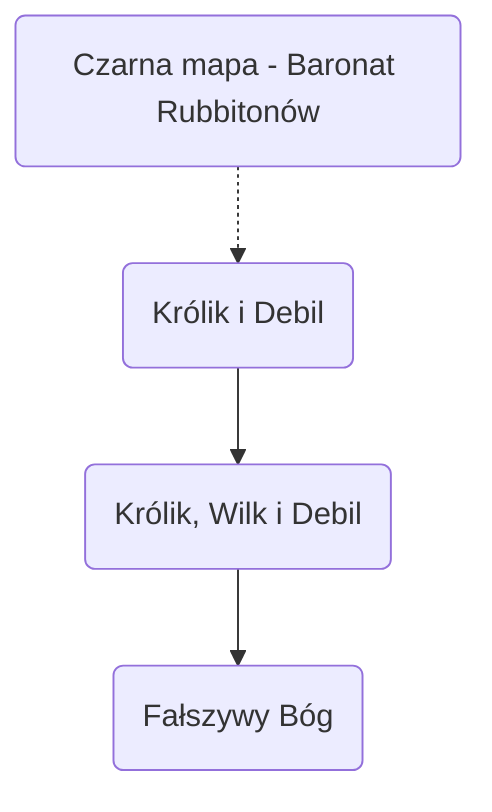
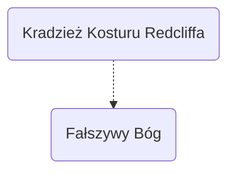

W tym miejscu przedstawiony jest timeline, z perspektywy każdego z bohaterów.
Całość wydarzeń dzieje się w jednej tej samej rzeczywistości, natomiast każdy z bohaterów uczestniczy w innych wydarzeniach nie raz dziejących się równolegle do innych.

Powoduje to, problem w prostym przedstawieniu chronologii wydarzeń na pojedynczej osi czasu czy diagramie przy wykorzystaniu obecnie dostępnych narzędzi.
## Legenda diagramów

- **Wydarzenia następujące bezpośrednio po sobie**

- **Wydarzenia z bliżej nieokreślonym dystansem czasowym**

## Timeline'y
### [[Aldakor Esku]]

### [[Alvira z Wieczornych Gwiazd]]

### [[Ichada]]

### [[Myhones Ray Aktonn]]

### [[Kian'Verion]]
